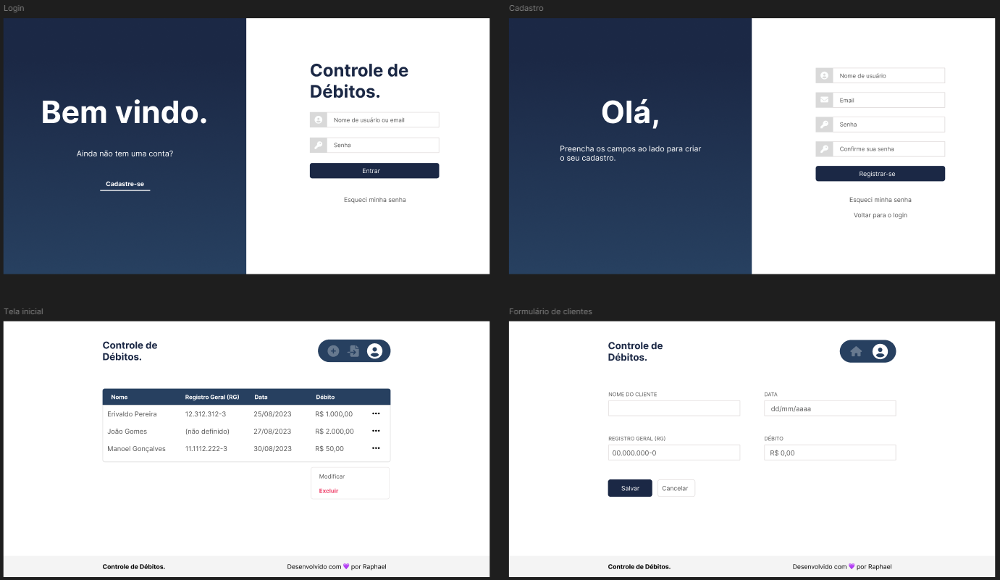

# Controle de Débitos

## O que tem aqui?

Essa aplicação não me ajuda em nada no meu dia a dia, pois é somente um CRUD inútil. Construi ela apenas para treinar minhas habilidades de prototipagem com o Laravel Blade, e aplicar conhecimento de autenticação e autorização do usuário e *parsing* de arquivo CSV.

## Tecnologias

- Laravel 12.x
- Blade + AlpineJS
- Tailwind CSS
- Vite
- SQLite

## Protótipos

## Ambiente de desenvolvimento

### Com Docker

🚧 _Em construção_

### Sem Docker

#### Dependências deste projeto

- Linux
- PHP
- Gerenciador de dependências Composer 
- Node.js
- Gerenciador de dependências NPM

#### Extensões PHP obrigatórias

    sudo apt-get install xml

#### Configurando o SQLite

Crie o arquivo database.sqlite na pasta database

Instalar extensão do sqlite3 para o PHP e o proprio sqlite3 para poder gerenciar as tabelas do banco

    sudo apt-get install php-sqlite3 sqlite3

#### Executando

Instale as dependencias

    npm i

    composer i

Gere a key

    php artisan key:generate

Execute as migrations

    php artisan migrate

Inicie o servidor

    composer run dev